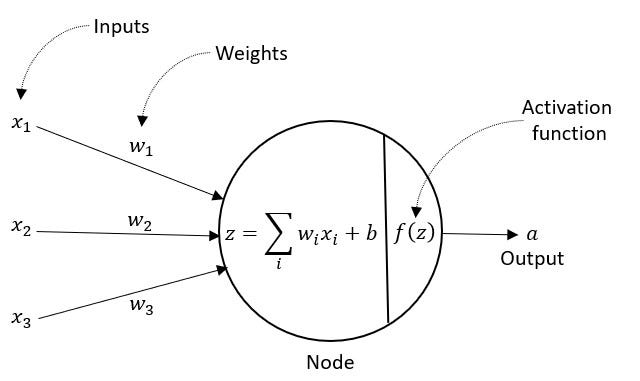
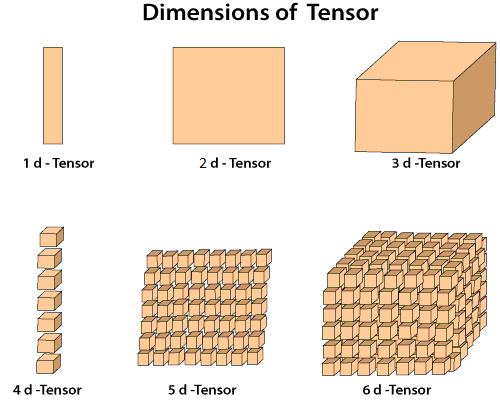
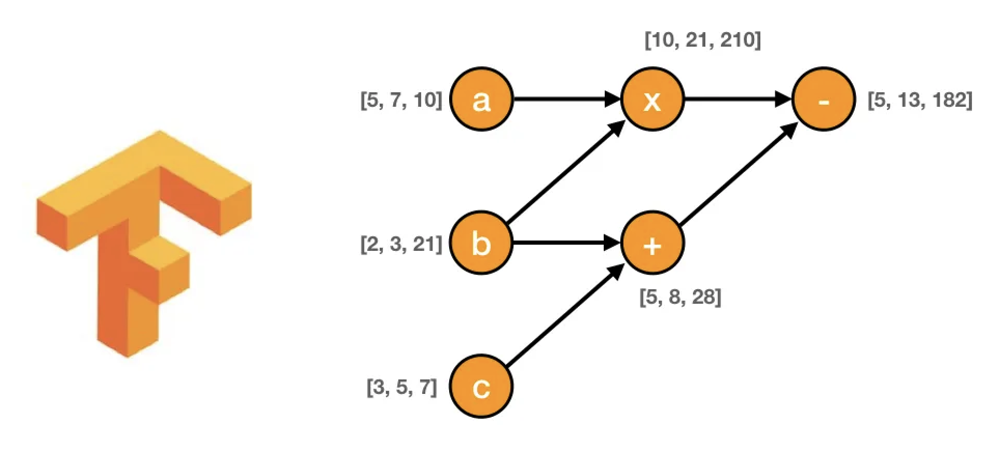

```{r setup, include=FALSE}
knitr::opts_chunk$set(echo = FALSE)
```

## About Me

- Computer Science Major
- UConn Data Science Club, President

{width=50%}

## Table of Contents

1. Data Science Pipeline

2. Research Question/Goal + Dataset

3. Data Cleaning

4. Data Preprocessing

5. Machine Learning & Deep Learning

6. Tensorflow

7. Model Deployment

## Data Science Pipeline


## Research Question/Goal + Dataset

- Given a specific soccer player, how can we identify similar soccer players?

- Dataset we will use: FIFA 22 Dataset
  - The FIFA 22 soccer player dataset refers to the collection of data included in the FIFA 22 video game, developed by EA Sports.
  - Derived from the real-life performances and characteristics of soccer players.
  
- Access the data [here](https://www.kaggle.com/datasets/stefanoleone992/fifa-22-complete-player-dataset?select=players_22.csv)!

## Data Cleaning

- Data is usually messy :(
  - Missing values.
  - Certain fields not formatted properly.
  - Data not in a desireable structure.
  - etc.
  


## Data Preprocessing

- The range of different feaures can vary.
  - This slows down the training process (which we will get into soon!)
- Certain features are categorical so need to convert then into numerical values.


{width=30%}


## Train, Validation, Test Datasets

- Train
  - Used to fit or "train" the model. The neural network learns to map inputs to outputs from this dataset.
  - The model sees and learns from this data iteratively; the parameters of the model (weights and biases) are adjusted to minimize the error between the model's predictions and the actual outcomes.
- Validation
  - Provides an unbiased evaluation of a model fit on the training dataset while tuning the model.
  - Gives insight on how well the training process is happening.
- Test
  - Offers an unbiased evaluation of a final model when the training and validation phases are completed.
  - Since the model's parameters are not adjusted based on this data, it simulates an independent assessment of how well the model is likely to perform on unseen data.
  
## Machine Learning (Supervised Learning)

- Supervised learning is a type of machine learning where a model is trained using labeled data to predict outcomes.

{width=50%}


## Gradient Descent

- Aims to find the minimum of a function by iteratively moving towards the steepest descent, as determined by the negative of the gradient.
- In each step, the parameters (typically model weights in machine learning) are updated in the direction that reduces the error most rapidly, calculated as a fraction of the gradient.
- The size of the steps taken in the search space is controlled by a parameter known as the learning rate. A too-small learning rate can slow down convergence, while a too-large learning rate can cause overshooting and divergence.

## Gradient Descent Example - Simple Linear Regression

$$ \hat{y} = mx + b $$

- Model Paramters: $m$, $b$
  - Randomly initialze paramters
- Error or Loss Function:

$$MSE = \frac{1}{n} \sum_{i=1}^n (y_i - \hat{y}_i)^2$$


{width=30%}

## Gradient Descent Example - Simple Linear Regression Cont.

$$MSE = \frac{1}{n} \sum_{i=1}^n (y_i - \hat{y}_i)^2$$

$$MSE = \frac{1}{n} \sum_{i=1}^n (y_i - (mx_i + b))^2$$

$$(y_i - mx_i - b)^2$$

$$b^2 + 2bmx_i - 2by_i + m^2x_i2 - 2mx_iy_i + y_i2$$

## Parabolid

{width=50%}

## Updating Parameters

- Take incremental steps of alpha tomards the minimum.

$$ m = m - \alpha\frac{\partial MSE}{\partial m}$$

$$ b = b - \alpha\frac{\partial MSE}{\partial b}$$

## Neural Networks

<center>

{width=40%}

</center>

<center>

{width=40%}

</center>

## Forward Propagation

- Passing input data through the layers of a neural network in a forward direction
- In each layer, the inputs are multiplied by the layer's weights and then summed together with a bias term. This process transforms the inputs into a set of values that are passed onto the next layer.
- After computing the linear combination of inputs and weights, an activation function is applied to introduce non-linearity into the model. This is crucial because it allows the network to learn non-linear patterns
  - Without these functions the NN is just linear transformer

## Backward Propagation

- Optimize the weights of the neural network by minimizing the loss function. It does this by efficiently computing the gradient of the loss function with respect to each weight in the network.
- It involves the transmission of the error signal from the output back towards the input layer, which helps in determining the contribution of each neuron to the total error. 

{width=50%}

## Tensorflow

- Developed by Google and the Open Source Community
-  It was created as a second-generation system based on Google's earlier DistBelief framework, designed to be more flexible and scalable.
- TensorFlow integrates with Keras, a high-level neural networks API, which is used for fast prototyping, advanced research, and production.

{width=50%}

## Tensor

- At its core, a tensor is a multidimensional array.
- All elements in a tensor must be of the same data type.
- A tensor’s size and shape (the number of elements in each dimension) are immutable.
- Tensors are used not just to store data, but also as inputs and outputs in computations.

{width=50%}

## Data Flow Graph

- TensorFlow allows developers to create dataflow graphs—structures that describe how data moves through a series of processing nodes or operations. 
- Each node in the graph represents a mathematical operation, and each edge represents data that is passed between these operations. 
- This model of computation enables efficient parallel processing and is particularly suited to the demands of deep learning.


{width=50%}

## Architecture

- Tensowflow 1.x
  - You explicitly build the entire computation graph. This includes all operations and how data (tensors) flows between them.
  - To run the graph you use a `Session` object, which executes the operations.
- Tensorflow 2.x
  - By default, TensorFlow operations are executed eagerly, as they are defined. 
  - They execute immediately and return their values directly.

{width=25%}

## Huber Loss


$$
L_\delta(a) = 
\begin{cases} 
\frac{1}{2}a^2 & \text{if } |a| \leq \delta, \\
\delta(|a| - \frac{1}{2}\delta) & \text{if } |a| > \delta,
\end{cases}
$$
- Provides a good balance by being less sensitive to outliers than squared error loss, while still maintaining a good efficiency and differentiability properties needed for optimization.

{width=50%}


## Gradient Descent (NN)

- The functional space is more complicated than a parabaloid.

{width=50%}


## Embeddings

- A vector representation of data.
- In the embedded space, similar items are represented by vectors that are close to each other, while dissimilar items are further apart.

{width=50%}

## AWS EC2

- EC2 offers a wide variety of instance types optimized for different use cases. 
- Severs on the cloud.


## Vector Databases

- Vector databases are specialized database systems designed to efficiently handle vector data
- Fast and efficient similarity searches.
- To facilitate quick retrieval of similar items, vector databases employ various indexing techniques that organize data in the vector space.
- MilvusDB is an open source vector db distributed as a docker container


## Deploying the Model

- Transfer all files including the encoder files using `scp`.
- Create flask app to expose Milvus and model as an API
- Connect the ec2 to a frontend html file.